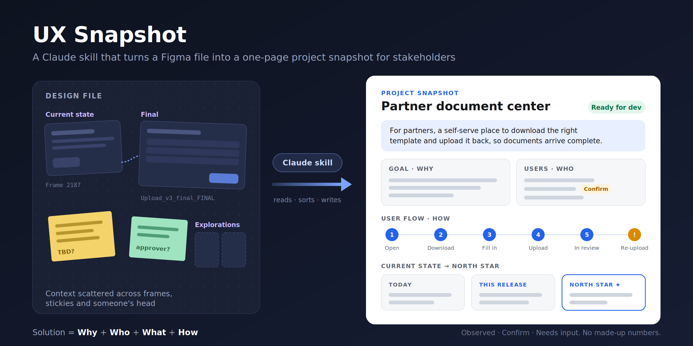
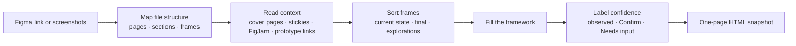

# UX Snapshot · Figma Project Snapshot skill for Claude



A Claude skill that turns a Figma file into a **one-page project snapshot** that any stakeholder can read in two minutes, without opening Figma or sitting through a walkthrough.

Point Claude at a Figma link (or a few screenshots) and you get back a clean, shareable page that explains **why** the project exists, **who** it's for, **what** is being built, and **how** people will use it.

---

## Quick start

**1. Share your Figma file.** Paste a Figma link (or drop in screenshots) and ask:

> "Make a project snapshot from this Figma file: `<link>`"

**2. Claude reads the file and fills in the snapshot.** It goes through your pages, frames, sticky notes, annotations and FigJam boards, and fills every section it can: goal, problem, users, type of experience, user flow, and the path from current state to north star.

**3. You fill in the gaps.** Anything the file doesn't show is flagged instead of guessed:

- **Confirm**: Claude's best guess from the designs. Reply "yes" or correct it.
- **Needs input**: a specific question Claude couldn't answer from the file, like *"How many resubmissions happen per month today?"*

Answer them in one reply, for example:

> "Reviewer role is correct. Admins don't exist in v1. Resubmissions are about 40 a month."

Claude updates the snapshot, and it's ready to share.

**Tip:** Want fewer gaps? Paste your PRD, brief or meeting notes along with the Figma link. You can also skip the file entirely and just describe the project. Claude will build the snapshot from what you tell it.

---

## Why this exists

Design projects are hard to understand from the outside. The context is scattered across pages, sticky notes, FigJam boards, frame names like `Upload_v3_final_FINAL`, and the designer's head. So PMs, engineers, execs and new teammates either:

- book a walkthrough meeting just to get oriented, or
- skim the screens and come away with the wrong idea.

A snapshot fixes that. It's the page you'd send before a review, at kickoff, during handoff, or when someone new joins the project.

## The framework

Every snapshot is built on one idea:

> **Solution = Why + Who + What + How**

and reads top to bottom as a journey from **Current state → North star**.

| Section | Answers | Part |
|---|---|---|
| **TL;DR** | The whole project in one sentence | all four |
| **Goal** | What outcome we're after | Why |
| **Problem** | What's broken today, for whom, and the evidence | Why |
| **Users** | Each role and what they need to get done | Who |
| **Type of experience** | Net-new feature, redesign, workflow, admin tool…; platform; main pattern | What |
| **User flow** | 4–8 steps in the user's words, tied to screens, with the main error path | How |
| **Current state → North star** | *Today* → *This release* → *North star* | the arc |
| **Decisions, open questions, risks** | What's settled and what isn't | — |

The order never changes. When stakeholders see many snapshots, they learn where to look.

## How it works



1. **Reads the structure first.** Claude maps pages, sections and frame names before taking any screenshots, so it finds the narrative instead of drowning in screens.
2. **Goes where designers leave context.** Cover pages, section labels, sticky notes, annotations, FigJam boards and prototype connections usually explain more than the UI does.
3. **Sorts frames by purpose.** *Current state* frames feed the Problem, *final* frames feed the User flow, *explorations* and *v2* frames feed the North star.
4. **Writes for non-designers.** Plain language, real screen names ("the upload screen", not "Frame 2187"), no jargon.
5. **Outputs one page.** A self-contained HTML file that supports light and dark mode, prints cleanly, and is easy to share as a link.

## It doesn't make things up

The most important rule in the skill. Every statement is one of three kinds:

| Label | Meaning | How it appears |
|---|---|---|
| **Observed** | It's in the file, an annotation, or notes you provided | Stated plainly |
| **Inferred** | Reasoned from the screens, e.g. an *Approve* button implies a reviewer role | Tagged **Confirm** |
| **Missing** | Nothing supports it | A specific **Needs input:** question |

Claude never invents metrics, research findings, dates or quotes to make a section look complete. One fabricated number can discredit a whole page, so honest gaps beat false completeness. At the end, you get a single checklist of every *Confirm* and *Needs input* item, so you can fix them all in one pass before sharing.

## Example

Input: a Figma link to a document management feature where partners download a template, fill it in, and upload it back.

Snapshot (abridged):

> **TL;DR:** For supplier partners, we're adding a document center where they download the right template and upload it back, so compliance documents arrive complete the first time instead of over email.
>
> **Users:** Partner contact (find, complete, upload, track status) · Internal reviewer `Confirm` · Admin who publishes templates `Confirm`
>
> **User flow:** Open Documents → download template → fill offline → upload from the same row → status shows *In review* → approved, or rejected with a reason and re-uploaded
>
> **Today → This release → North star:** templates by email with no version control → self-serve download/upload with status → in-browser completion with smart pre-fill `Confirm`
>
> **Needs input:** How many resubmissions happen per month today?

## Using it

Once installed, just ask in plain language:

- "Make a project snapshot from this Figma file: `<link>`"
- "Summarize this design for my stakeholders"
- "I need a one-pager on this project before Thursday's review"
- "Turn these screenshots into a project overview" *(attach images)*

It works best with the **Figma connector** enabled in Claude, since that gives it layer names, annotations and FigJam boards. Without it, upload screenshots and expect a few more *Needs input* items. Pasting a PRD or brief alongside the link improves the Goal and Problem sections a lot.

## Install

- **Claude.ai / Claude Desktop:** download [`figma-project-snapshot.skill`](./figma-project-snapshot.skill) and upload it in Claude's Skills settings.
- **Claude Code:** copy this repo's skill files into `~/.claude/skills/figma-project-snapshot/`.

## What's in the repo

```
SKILL.md                         The workflow and rules Claude follows
references/figma-extraction.md   How to read a Figma file for context, and what UI signals mean
references/section-guide.md      Weak vs strong examples for every section
assets/snapshot-template.html    The one-page HTML output (light/dark, print-ready)
scripts/parse_figma_url.py       Turns a Figma URL into file key + node id (design, FigJam, branches)
figma-project-snapshot.skill     Packaged skill, ready to install
docs/intro.svg, intro.png        The intro image above (SVG source + PNG)
```

## Roadmap

- Test against more real-world Figma files and tune the extraction order
- Optional slide and Markdown outputs styled to match the HTML page
- Pull unresolved Figma comments directly into *Open questions*

## About

Built by **Raghurai (Rai) Kulkarni**, Lead Product Designer working on enterprise B2B SaaS, AI-assisted workflows and design systems. The framework comes from how I explain projects to stakeholders: *design is not a recipe, it is clarity through iteration.*

Licensed under MIT.
